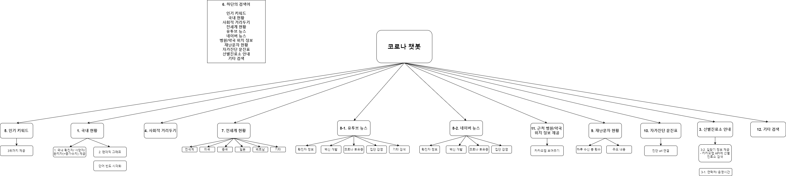

[](https://opensource.org/licenses/)
[](#contributors-)
# 2020-2-OSSP-CP-CICE-8
[데이터사이언스 연계전공]Team_CICE

## Member

* [유영현](https://github.com/0hyunU)
* [권나영](https://github.com/i-zro)
* [송승민](https://github.com/SeungMinSong2929)
* [문소연](https://github.com/opsop)

## About
[Corona-Tracker API](https://github.com/Kamaropoulos/COVID19Py/blob/master/README.md#about) 활용 코로나 챗봇.

### Installation
```bash
sudo apt install python3-pip #install pip
python3 -m pip install --upgrade pip
pip install Flask
pip install COVID19Py
```

## Bot Diagram

