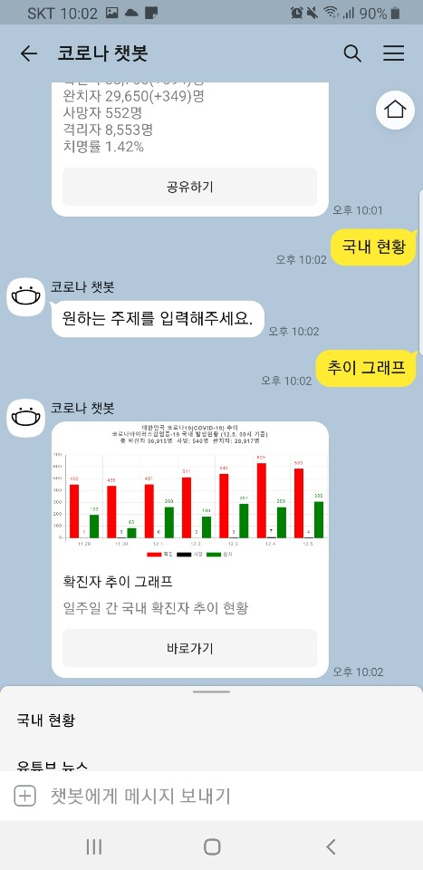
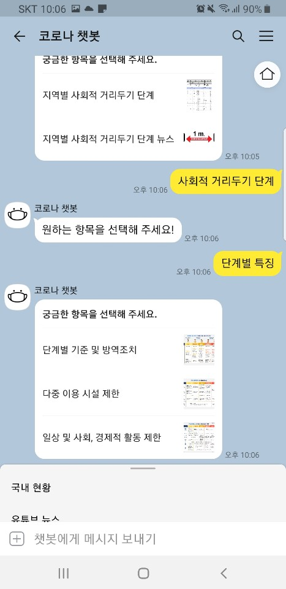
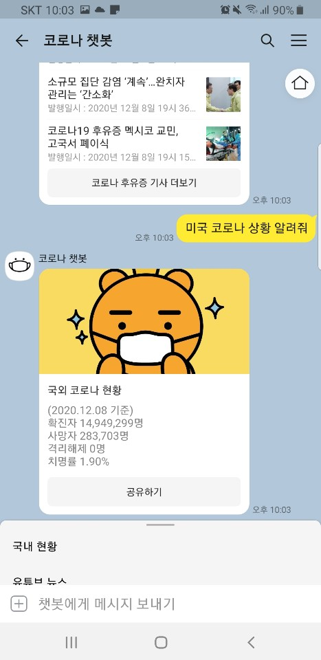
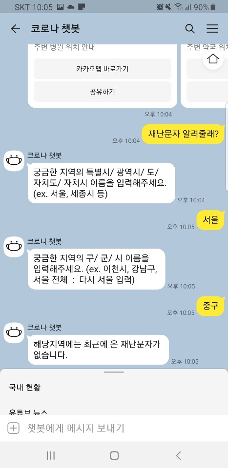
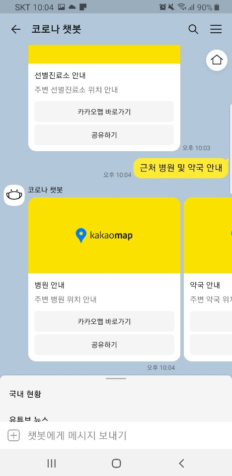

[](https://opensource.org/licenses/)
[](#contributors-)
# 2020-2-OSSP-CP-CICE-8
[데이터사이언스 연계전공]Team_CICE

## Member

* [유영현](https://github.com/0hyunU)
* [권나영](https://github.com/i-zro)
* [송승민](https://github.com/SeungMinSong2929)
* [문소연](https://github.com/opsop)

## About
* 카카오 오픈빌더를 활용하여 개발한 코로나 챗봇.
* 카카오톡에 "코로나 챗봇" 채널 친구를 통해 확인 가능. ➡ [Click Here](https://pf.kakao.com/_KgxlnK)

## Used APIs
[chatbot_organization.md](https://github.com/CSID-DGU/2020-2-OSSP-CP-CICE-8/blob/main/chatbot_organization.md)에 안내.

### Installation
1. Clone git repository
```
git clone https://github.com/CSID-DGU/2020-2-OSSP-CP-CICE-8.git
cd server
```

2. Install required packages
Linux Terminal / Windows cmd, PowerShell / Git bash
```
sudo apt install python3-pip #install pip
python3 -m pip install --upgrade pip
pip install Flask
pip install COVID19Py
pip install bs4
pip install requests
pip3 install matplotlib
pip install apscheduler
```
3. run server
```
python chatbot.py runserver
```
```
http://0.0.0.0:5000/ -> http://ip-address:5000/ 
```
use your own ip-address

## Bot Diagram


*** 
## Directory Tree

```
├─.idea
│  └─inspectionProfiles
├─.ipynb_checkpoints
├─botproject
│  ├─botbot
│  │  ├─migrations
│  │  │  └─__pycache__
│  │  ├─templates
│  │  └─__pycache__
│  ├─botproject
│  │  └─__pycache__
│  └─static
│      ├─admin
│      │  ├─css
│      │  │  └─vendor
│      │  │      └─select2
│      │  ├─fonts
│      │  ├─img
│      │  │  └─gis
│      │  └─js
│      │      ├─admin
│      │      └─vendor
│      │          ├─jquery
│      │          ├─select2
│      │          │  └─i18n
│      │          └─xregexp
│      ├─assets
│      │  ├─css
│      │  └─img
│      └─js
├─bot_monitoring
│  ├─bot_image
│  └─scenario
├─chatbot_data
│  └─entity
├─proposal
└─server
    ├─CoronaBotDB
    ├─msg_app
    │  └─__pycache__
    ├─refer
    │  ├─CoronaBot-master
    │  └─kakaoisdk
    │      ├─examples
    │      └─kakaoi
    └─__pycache__
```

## Bot images

<table class="tg">
<thead>
  <tr>
    <th class="tg-vox4">기능</th>
    <th class="tg-vox4">사진</th>
    <th class="tg-vox4">설명</th>
  </tr>
</thead>
<tbody>
  <tr>
    <th class="tg-73a0">1. 국내 현황 보기</th>
    <td class="tg-73a0"></td>
    <td class="tg-73a0">국내 코로나 확진자/ 완치자/ 사망자/ 치명률 등의 정보 제공</td>
  </tr>
  <tr>
    <th class="tg-73a0">2. 국내 현황 추이 그래프</th>
    <td class="tg-73a0"></td>
    <td class="tg-73a0">추이 그래프 이미지와 정부 통계청 사이트 연결 버튼 제공</td>
  </tr>
  <tr>
    <th class="tg-73a0">3. 선별진료소 안내</th>
    <td class="tg-73a0"></td>
    <td class="tg-73a0">카카오맵에 선별진료소 안내</td>
  </tr>
  <tr>
    <th class="tg-73a0" rowspan="2">4. 사회적 거리두기 단계</th>
    <td class="tg-73a0"></td>
    <td class="tg-73a0">단계별 특징 안내</td>
  </tr>
  <tr>
    <td class="tg-73a0"></td>
    <td class="tg-73a0">지역별 단계보기 정보 제공</td>
  </tr>
  <tr>
    <th class="tg-73a0">5. 인기 키워드</th>
    <td class="tg-73a0"></td>
    <td class="tg-73a0">챗봇 인기 키워드 3위까지 제공</td>
  </tr>
  <tr>
    <th class="tg-73a0">6. 하단에 검색어 선택 기능</th>
    <td class="tg-73a0"></td>
    <td class="tg-73a0">하단에 검색어 선택 가능</td>
  </tr>
  <tr>
    <th class="tg-73a0">7. 전세계 현황 보기</th>
    <td class="tg-73a0"></td>
    <td class="tg-73a0">전세계 코로나 확진자/ 사망자/ 격리해제/ 치명률 정보 제공</td>
  </tr>
  <tr>
    <th class="tg-73a0" rowspan="2">8. 뉴스 제공 기능</th>
    <td class="tg-73a0"></td>
    <td class="tg-73a0">네이버 뉴스 링크 연결</td>
  </tr>
  <tr>
    <td class="tg-73a0"></td>
    <td class="tg-73a0">유투브 뉴스 링크 연결</td>
  </tr>
  <tr>
    <th class="tg-73a0">9. 재난 문자 보기</th>
    <td class="tg-73a0"></td>
    <td class="tg-73a0">해당 지역의 최신 재난문자 최대 3개까지 제공</td>
  </tr>
  <tr>
    <th class="tg-73a0">10. 자가진단 문진표</th>
    <td class="tg-73a0"></td>
    <td class="tg-73a0">코로나 자가진단과 코로나 블루 자가진단 가능</td>
  </tr>
  <tr>
    <th class="tg-z9od">11. 근처 병원 및 약국 안내</th>
    <td class="tg-z9od"></td>
    <td class="tg-z9od">카카오맵에 근처 병원과 약국 정보 제공</td>
  </tr>
</tbody>
</table>


