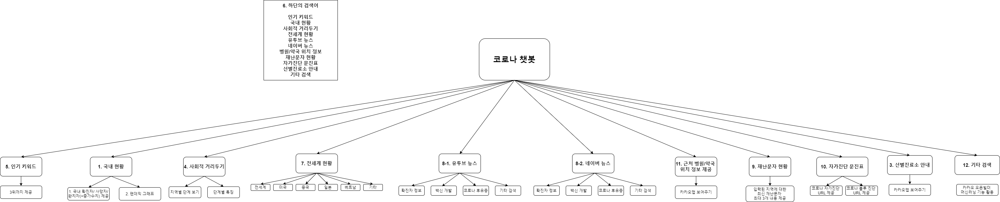
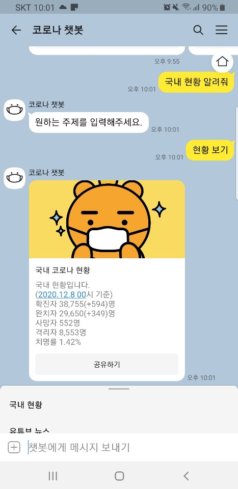

[](https://opensource.org/licenses/)
[](#contributors-)
# 2020-2-OSSP-CP-CICE-8
[데이터사이언스 연계전공]Team_CICE

## Member

* [유영현](https://github.com/0hyunU)
* [권나영](https://github.com/i-zro)
* [송승민](https://github.com/SeungMinSong2929)
* [문소연](https://github.com/opsop)

## About
* 카카오 오픈빌더를 활용하여 개발한 코로나 챗봇.
* 카카오톡에 "코로나 챗봇" 채널 친구를 통해 확인 가능.

## Used APIs
[chatbot_organization.md](https://github.com/CSID-DGU/2020-2-OSSP-CP-CICE-8/blob/main/chatbot_organization.md)에 안내.

### Installation
1. Clone git repository
```
git clone https://github.com/CSID-DGU/2020-2-OSSP-CP-CICE-8.git
cd server
```

2. Install required packages
Linux Terminal / Windows cmd, PowerShell / Git bash
```
sudo apt install python3-pip #install pip
python3 -m pip install --upgrade pip
pip install Flask
pip install COVID19Py
pip install bs4
pip install requests
pip3 install matplotlib
pip install apscheduler
```
3. run server
```
python chatbot.py runserver
```
```
http://0.0.0.0:5000/ -> http://ip-address:5000/ 
```
use your own ip-address

## Bot Diagram


## Bot images



