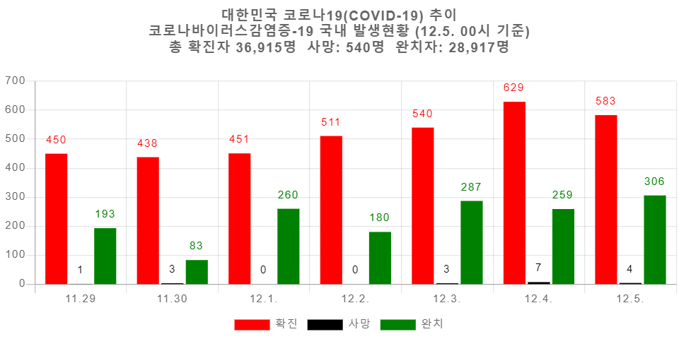

# 시각화 이미지 

1. clone 후, 가상환경 설정
git clone 받은 후에, <br>
virtualenv 설치
```
pip install virtualenv
```

2. 가상환경 생성
```
virtualenv vial
```

3. 가상환경 활성화 
Mac OS / Linux
```
source vial/bin/activate
```

4. 설치
```
(vial) pip install -r requirements.txt
(vial) pip install flask
(vial) python -m pip install --upgrade pip
```

5. 실행
```
(vial) cd botproject
(vial) python manage.py runserver
```
After running the server in your localhost, check whether everything's good in to click [here](http://127.0.0.1:8000/)

*** 

## 데이터베이스 설정 및 dbdump.json 활용
현재 데이터베이스를 dbdump.json파일로 저장(ump database into dbdump.json )
```
(vial) python manage.py dumpdata --natural-foreign --natural-primary --indent=4 -o dbdump.json
```
***
데이터베이스를 덤프한 파일에서 데이터베이스를 불러옴(oad database from dumped file)
```
(venv) python manage.py flush
(venv) python manage.py loaddata dbdump.json
```
***

## 시각화 이미지


***
이미지 링크
```
https://i.esdrop.com/d/KVTpYYElDK.png
```